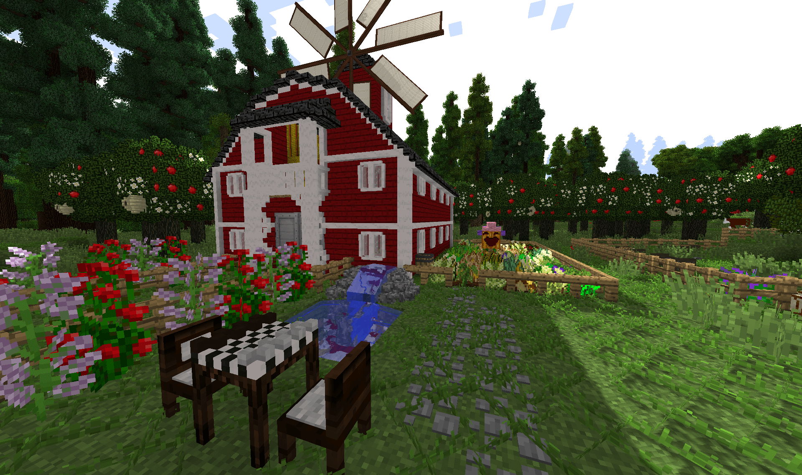
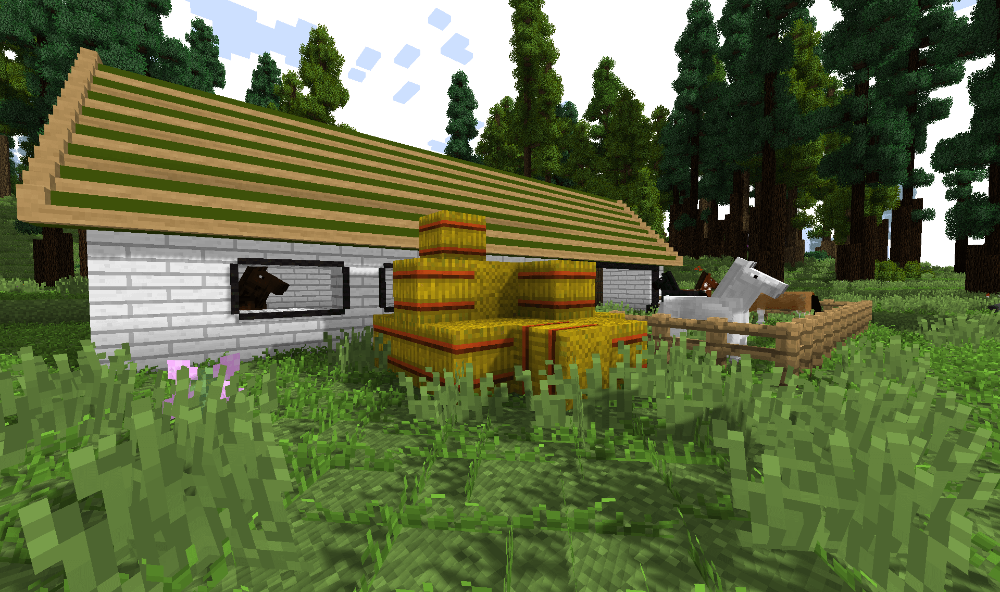

# Homestead

[Download through ATLauncher.](https://www.atlauncher.com/pack/Homestead)

Homestead is a quest-based hardcore survival pack.  Highly inspired by TerraFirmaPack, it offers a revamped tech tree and new game mechanics.

Focusing initially on wilderness survival, you will progress to mechanical energy for early automation and ultimately learn to harness electrical energy.  Different tiers of metals are scattered through the world, and may require unique methods to obtain.

An optional quest book is provided to explain gameplay changes, and to nudge the player in the right direction if they're stuck.

Homestead offers unique mod interactions so the pack feels more cohesive, and less like a "kitchen sink".  A custom nutrition system was also written to encourage dietary variety in a realistic setting.

This is a difficult pack, and experience with modded Minecraft is suggested.  There are very few "magic blocks"; instead you are provided the tools to assemble and automate your own creations.

Homestead was designed to work as a base for new survival-focused packs.  It remains compatible with much of the existing mod ecosystem, and dropping in new mods should work without requiring configuration.  Of course, this will affect game balance.

Please use the Github [issue tracker](https://github.com/WesCook/Homestead/issues) to report any problems.

**Note:** Existing worlds will not automatically receive quest changes on pack updates.  On clients, you can run `/bq_admin default load` as an op to update existing worlds.  On servers, please copy the file `/config/betterquesting/DefaultQuests.json` over `/world/betterquesting/QuestDatabase.json`.

